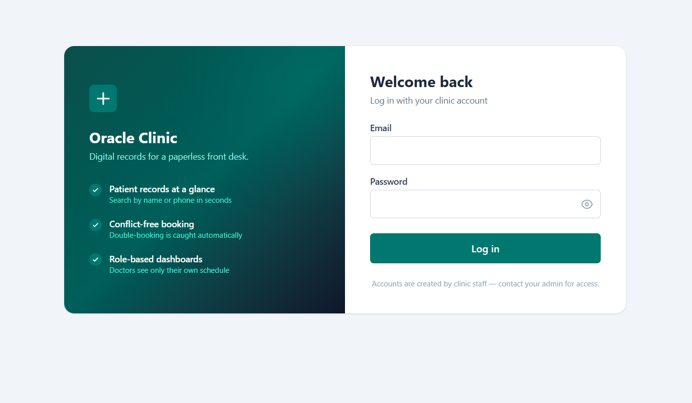
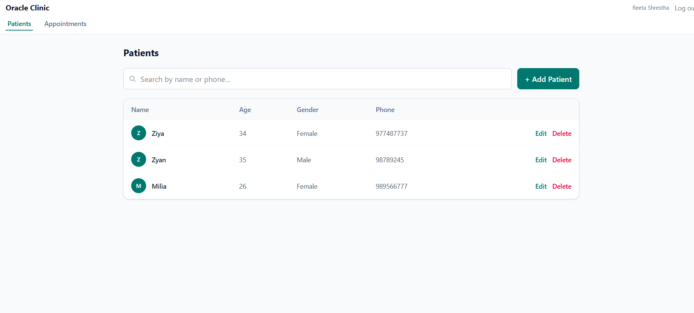
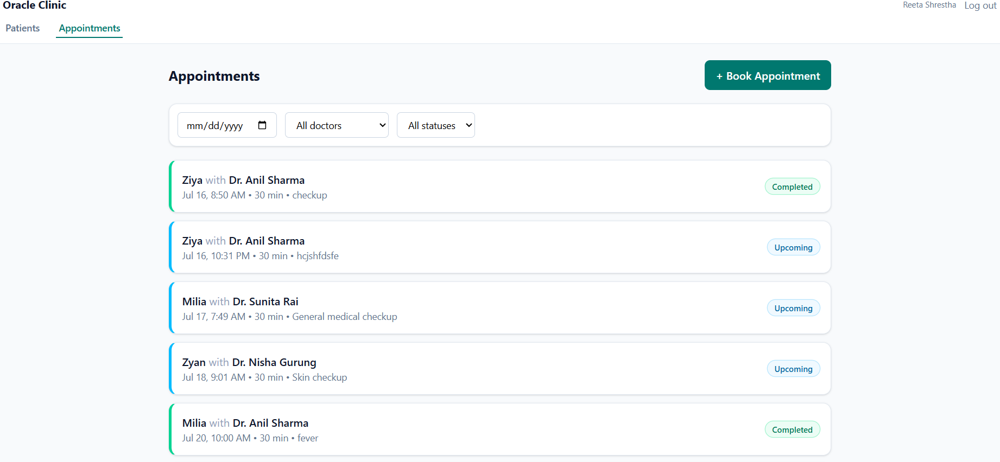
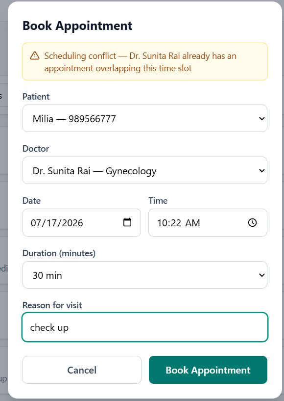
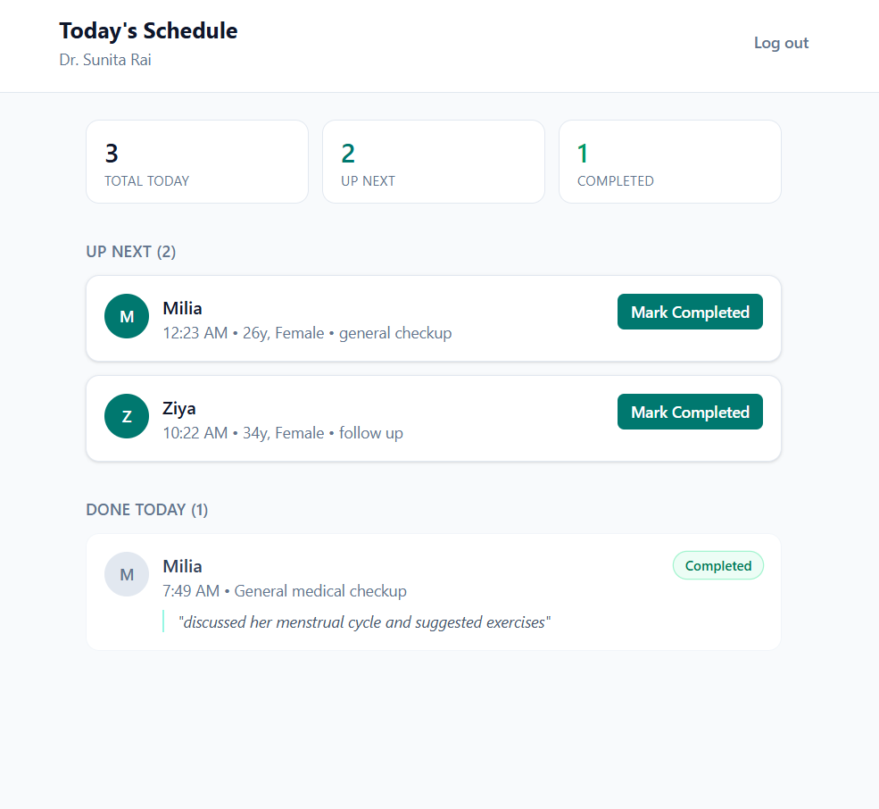

# Oracle Clinic — Clinic Management MVP

A two-role clinic management web app (Receptionist / Doctor) built for the Oracle Brain Full Stack Developer Internship technical assessment. Supports patient records, appointment booking with server-side double-booking prevention, and role-scoped dashboards.

## Live Demo

- **Frontend:** https://clinic-app-iota-five.vercel.app
- **Backend API:** https://clinicapp-f14c.onrender.com/api

> Note: the backend is on Render's free tier, which spins down after inactivity. The first request after idle time may take 30–60 seconds to respond while the server wakes up.

## Test Accounts

| Role | Email | Password |
|---|---|---|
| Receptionist | reception@clinic.test | password123 |
| Doctor | anil@clinic.test | password123 |
| Doctor | priya@clinic.test | password123 |
| Doctor | sunita@clinic.test | password123 |
| Doctor | bikash@clinic.test | password123 |
| Doctor | nisha@clinic.test | password123 |

## Tech Stack

- **Frontend:** React + TypeScript, Tailwind CSS, React Router, Axios
- **Backend:** Node.js, Express, Zod (validation)
- **Database:** MongoDB (Atlas), Mongoose
- **Auth:** JWT, bcrypt password hashing
- **Deployment:** Vercel (frontend), Render (backend), MongoDB Atlas (database)

## Features Completed

**Authentication & Roles**
- Login for Receptionist and Doctor roles
- Role-based access control enforced server-side on every protected route (not just hidden in the UI)

**Patient Management (Receptionist)**
- Create, view, edit, delete patient records
- Search by name or phone number

**Appointment Booking (Receptionist)**
- Book appointments: patient, doctor, date/time, duration, reason
- Server-side conflict check prevents double-booking the same doctor at an overlapping time
- Back-to-back appointments (one ending exactly when the next starts) are correctly allowed, not flagged as conflicts
- Appointment list with filters by date, doctor, and status

**Doctor Dashboard**
- Doctor sees only their own appointments for the day (scoped from their JWT, never from a client-supplied ID)
- Mark an appointment Completed with an inline consultation note

**Responsive UI**
- Distinct mobile and desktop layouts (not just a shrinking table) across all screens

## Screenshots

### Login


### Patients


### Appointments


### Booking with conflict detection


### Doctor Dashboard


## Setup & Run Locally

### Backend
```bash
cd backend
npm install
cp .env.example .env   # then fill in your own MONGO_URI and JWT_SECRET
npm run seed            # creates receptionist + 5 doctor test accounts
npm run dev              # starts on http://localhost:5000
```

### Frontend
```bash
cd frontend
npm install
cp .env.example .env   # defaults to http://localhost:5000/api, fine for local dev
npm run dev              # starts on http://localhost:5173
```

## Architecture Notes

- **Conflict-check logic** lives in `backend/src/utils/overlap.js` as a pure, unit-tested function, separate from the database layer — two intervals conflict only if `existingStart < newEnd AND existingEnd > newStart`.
- **Role access** is enforced via Express middleware (`requireAuth`, `requireRole`) applied per-route on the backend; frontend routing (`ProtectedRoute`) mirrors this for UX only, not as the actual security boundary.
- **Doctor scoping** (`/api/appointments/mine`) always reads the doctor's ID from their verified JWT, never from a query parameter, so a doctor cannot view another doctor's schedule.

## Known Limitations

- No automated test suite (Postman collection used for manual/API-level testing during development, see `/postman` folder if included)
- No timezone handling beyond server-local time
- Render free tier cold-starts after inactivity
- CORS currently allows all origins; a production deployment would restrict this to the exact frontend domain

## AI Usage Note

I used Claude (Anthropic) throughout this project as a build partner — it walked me through each piece step by step, and I wrote/tested/debugged the actual code myself in my own editor.

**What I used AI for:**
- Scaffolding boilerplate (Express routes, Mongoose schemas, React component structure)
- Designing the conflict-check algorithm and explaining the interval-overlap math
- Debugging real errors I hit (case-sensitivity import bugs between Windows and Render's Linux filesystem, a missing git commit, Vercel SPA routing 404s)
- Suggesting the Zod validation pattern and the visual design direction

**What I did myself:**
- Wrote and ran every line of code in my own environment
- Tested the conflict-check logic manually against edge cases (exact overlap, partial overlap, back-to-back, cancelled appointments, self-edit) before trusting it
- Diagnosed and fixed real bugs (missing files not committed to git, filename case mismatches, unused imports breaking the production build)
- Made the assumptions documented above and decided the UI/UX direction

I can walk through and modify any part of this codebase live, including explaining why the conflict check uses strict inequalities, why doctor ID is read from the JWT rather than the request, and the tradeoffs behind each design decision above.
